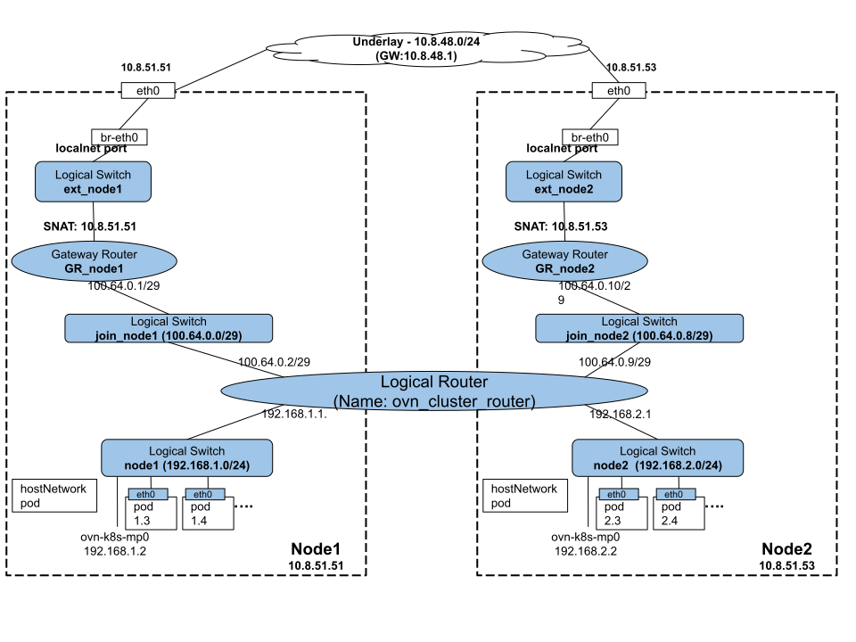
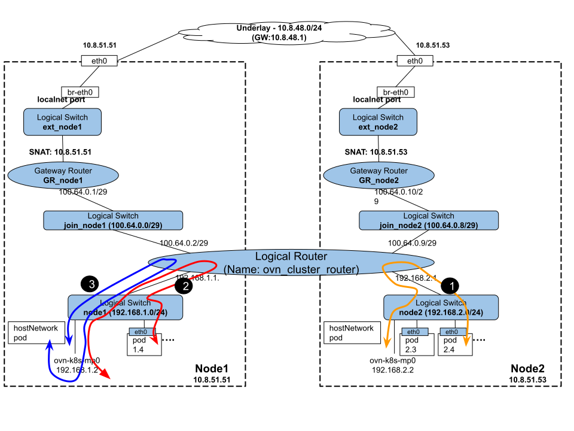
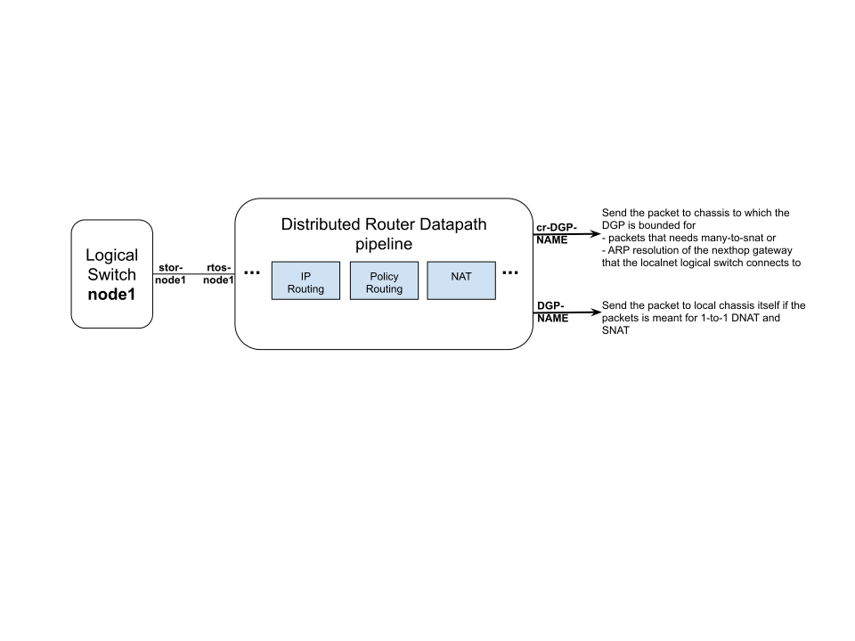
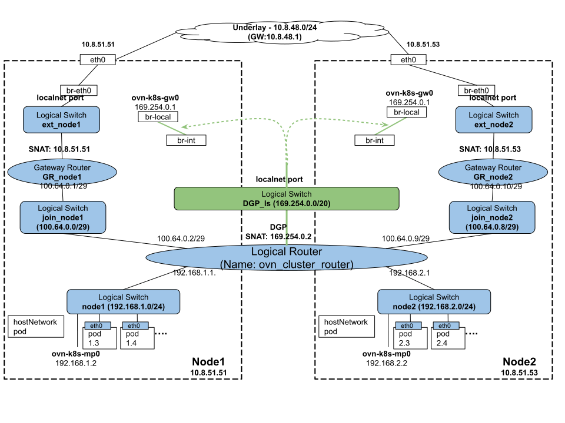
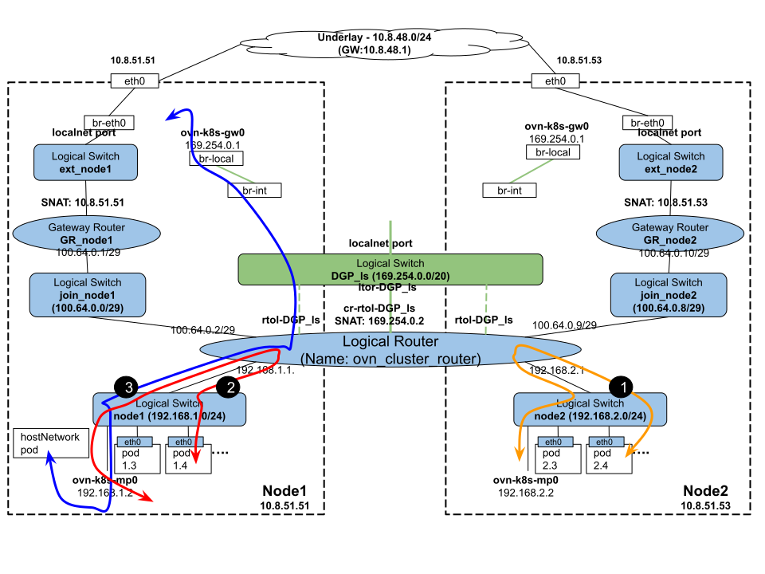

# Enable Node-Local Services Access in Shared Gateway Mode

## Introduction ##
This document captures a proposal for adding a section to the current OVN Logical Topology to
support pods (both on overlay network and host network) to communicate with the services on
the node it is on. Before we jump on to the new topology, we are going to look at the current
topology and understand how it provides that access (or not) today. Next, we understand 
some of the OVN features on top of which the changes to the current topology is built on.
Finally, we are going to look at the new OVN Logical topology.

**NOTE:** This change is required only for the shared gateway mode. In this mode, we share the
IP address of the node to SNAT the traffic going out of the OVN Logical network to the
physical network. The OVN Gateway router does this SNATing. When a packet with destination
IP set to the Node IP arrives on the `ingress` pipeline of the Gateway Router, it expects
the packet to be one of these things:

1. a packet for NodePort service and it DNATs it to one of the backend IPs
2. a reply packet for an already established (or in the process of) connection

If it sees a packet from the OVN logical topology towards the Node IP, then it gets dropped
since it doesn’t fit (1) or (2) above. 

## Current OVN Logical Topology ##
The following diagram captures the OVN logical topology for a two-node k8s cluster.



All the pods in a given node are connected to a node specific logical switch named after
node’s hostname. The east-west traffic between pods on a node with all pods on all nodes,
without NAT, is provided by the distributed logical router named ovn_cluster_router. The
north-south traffic between the pod and the external network is provided by the gateway
logical router connected to the external logical switch. The outbound traffic is SNATed
on the gateway logical router and then sent out to the underlay physical network.  The
node-specific external gateway logical router is connected to the distributed logical
router by a node-specific join logical switch.

Since the focus of this document is the pod to node-local service traffic, let us deep dive
into it. From that point of view, there are three flows that we care about and the following
diagram captures those three traffic flows.



The Logical Static Routes on the ovn_cluster_router is as shown below and will help us in
understanding the next set of sections.
```text
# ovn-nbctl lr-route-list ovn_cluster_router
IPv4 Routes
               10.8.51.51                192.168.1.2 dst-ip
               10.8.51.53                192.168.2.2 dst-ip
           192.168.1.0/24                100.64.0.4 src-ip
           192.168.2.0/24                100.64.0.3 src-ip

```

### Traffic Between Overlay-Network Pod and Node’s IP ###
This refers to the traffic flow (1) in the diagram above. Consider a Pod running on the overlay
network and that is scraping the metrics off of the kubelet running on the node. The following
table captures the packet trace for the “TCP SYN” packet originating at the pod. 

Where | SrcIP:Port | dstIP:Port | comments |
------| -----------|------------|----------|
node2 | 192.168.2.4:9991 |10.8.51.53:10250 |
ovn_cluster_router | 192.168.2.4:9991 |10.8.51.53:10250 |A static route here sets the nexthop to 192.168.2.2 and forwards the packet to the management port |
ovn-k8s-mp0 | 192.168.2.4:9991 |10.8.51.53:10250 | Packet is received by the dest

The reverse path is symmetrical and re-traces all the physical/logical network elements in the
original path. All the connection-tracking states will be popped/matched and appropriate actions
will be applied and the reply packet will reach the pod.

### Traffic Between Overlay-Network Pod and Cluster IP ###
This refers to the traffic flow (2) in the diagram above. Consider a pod running on the K8s API
server and wants to connect to the kubernetes service cluster IP (say, 10.96.0.1). The backend
IP for this is the local node itself. The following table captures the packet trace for the
“TCP SYN” packet originating at the pod.

Where|SrcIP:Port|dstIP:Port|comments|
------| -----------|------------|----------|
node1|192.168.1.4:9991|10.96.0.1:443|A LB DNAT rule here DNAT’s the VIP of 10.96.0.1:443 to 10.8.51.51:6443|
ovn_cluster_router|192.168.1.4:9991|10.8.51.51:6443|A static route here sets the nexthop to 100.64.0.3 and forwards the packet to node’s local gateway router
ovn-k8s-mp0|192.168.1.4:9991|10.8.51.51:10250|Packet is received by the dest

The reverse path is symmetrical and re-traces all the physical/logical network elements in
the original path. In fact, this flow is similar to the 1st flow after the DNAT occurs.

### Traffic Between Host-Network Pod and Cluster IP ###
This refers to the traffic flow (3) in the diagram above. Consider a host network pod, say
Multus,  running on the K8s API server and wants to connect to the kubernetes service cluster
IP (say, 10.96.0.1) to get network attachment information. The backend IP for this is the
local node itself. The following table captures the packet trace for the “TCP SYN” packet
originating on the node. Depending on the application, it is possible that the source IP
address could be the node’s IP or the management port’s IP address.

Where|SrcIP:Port|dstIP:Port|comments|
------| -----------|------------|----------|
ovn-k8s-mp0 | 10.8.51.51:9991 or 192.168.1.2:9991| 10.96.0.1:443 | An iptable SNAT rule on the host translates all the packets entering the management port with management port’s IP address
node1|192.168.1.2:9991|10.96.0.1:443|A LB DNAT rule here DNAT’s the VIP of 10.96.0.1:443 to 10.8.51.51:6443
ovn_cluster_router|192.168.1.2:9991|10.8.51.51:6443|A static route here sets the nexthop to 100.64.0.3 and forwards the packet to node’s local gateway router
ovn-k8s-mp0|192.168.1.2:9991|10.8.51.51:10250|Packet is received by the dest
 |  Reply packet from the host (Gets dropped) |
loopback|10.8.51.51:10250|192.168.1.2:9991|Packet drop (see below)|

The reply packet from the host gets dropped on the floor on the host. Both of the IP addresses
10.8.51.51 and 192.168.1.2 are on the directly attached interface in the host network
namespace. So, the host stack tries to short-circuit the packet within the host and the TCP
state machine cannot match the sent ACK  because it comes in as (src:10.8.51.51,
 dst 192.168.1.2) whilst the SYN was sent as (src:192.168.1.2, dst:10.96.0.1).

We have tried connection marking using iptable rules in `mangle table` and using Linux Policy
Based Routing (via ip rule) to make such packets to lookup a different routing table, but
nothing works. It only complicates the OVN K8s control plane.

We are striving hard to ensure that the OVN K8s Control Plane is completely confined to the
OVN feature set. Having to rely on both OVN features and iptables/iprules on the host stack
complicates the control plane and makes it harder to debug and reason about.

## New OVN Logical Topology ##
As it is clear from the previous section that the static routes on the distributed router
that steers traffic to local node services through management port only works for
two-out-of-three flows mentioned in the aforementioned sections. The new topology provides a
clean path for all the three flows and this is achieved with the help of a distributed gateway
port, policy based routing policies, and 1-to-1 NAT. 
    
### OVN Features Used ###
Before we dive into the new logical topology, it is important to understand the following
three concepts (please see the diagram below on how these three things tie together)



#### OVN’s Support for Policy Based Routing (PBR) ####
PBR provides a way to configure reroute policies on the logical router. These policies are
captured in a policy-routing table in the router's ingress pipeline. This table itself is
present after the IP routing table and therefore can override routing decisions and provide
a different next-hop. The new topology leverages this feature to steer the traffic from pods
on nodes to node-local services in certain ways.

#### OVN’s Support for 1-to-1 NAT ####
One can configure one-to-one NAT for a logical port so that all the packets from the logical
port heading out of logical topology will be SNATed to this exclusive IP, called external_ip,
set aside for it. Since the external_ip is dedicated to the logical_port, the NATing can
occur on the chassis where the logical port is bound. The new topology leverages this
feature on every node.

#### Packet processing with distributed gateway port ####
We create a distributed gateway port (DGP)  on a distributed router by adding a logical router
port to it and connecting that port to a logical switch that has a localnet port (pathway to
underlay). For the DGP, we also need to specify the chassis on which this port must be bound.
The packets flowing through the DGP are either processed centrally on the bound chassis or are
processed on the local chassis. For this reason, a DGP comes as two ports -- 
chassis-redirect-DGP (cr-DGP) and DGP. If the packet needs to be centrally processed, then it
is sent to cr-DGP which then forwards the packet to the bound gateway chassis through a
geneve tunnel. On the other hand, if the packet needs to be locally processed then it is sent
to the DGP that exists on the local chassis (and every chassis since its distributed).

Flows requiring central processing:
- If the packets from the logical switches behind the distributed router want to exit out of
the logical topology and if there is no one-to-one NAT mapping for the said traffic flow,
then the packets are redirected to cr-DGP.
- ARP resolution of the nexthop physical gateway occurs on the bound chassis through the local
net port

Flows that can be locally processed:
- If there is a matching one-to-one NAT rule for an outbound network traffic, then it is sent
to DGP that is locally present on the chassis.

### OVN Logical topology with distributed gateway port ###

The following diagram captures the new logical topology with the distributed gateway port created
on the distributed router, ovn_cluster_router



There is no change to the
path taken by the east-west traffic between the pods on all the nodes and 
path taken by the north-south traffic from the pods on a node to external network 
from the current topology.

However, the traffic between the pods on a node to node-local services changes and they now go through the distributed gateway port on the node itself. Note that there is no centralized processing whatsoever in this topology. So, we don’t need to handle HA for DGP and there is no need to run BFD between all the chassises and the HA gateway chassises.

The following diagram captures the three traffic flows in the new logical topology



The following Logical Static Routes, Logical Policies, and NAT rules on the distributed router helps us understand the next set of sections.
```text
$ ovn-nbctl lr-route-list ovn_cluster_router
IPv4 Routes
            192.168.1.0/24                100.64.1.1 src-ip
            192.168.2.0/24                100.64.0.1 src-ip
$ ovn-nbctl lr-policy-list ovn_cluster_router
Routing Policies
      1005 ip4.src == 192.168.1.2 && ip4.dst == 10.8.51.51         reroute        169.254.0.1
      1005 ip4.src == 192.168.2.2 && ip4.dst == 10.8.51.53         reroute        169.254.0.1
      1004 inport == "rtos-k8s-node1" && ip4.dst == 10.8.51.51   reroute        192.168.1.2
      1004 inport == "rtos-k8s-node2" && ip4.dst == 10.8.51.53   reroute        192.168.2.2
$ ovn-nbctl lr-nat-list ovn_cluster_router
TYPE                  EXTERNAL_IP   LOGICAL_IP      EXTERNAL_MAC     LOGICAL_PORT
dnat_and_snat    169.254.0.3       192.168.1.2         c6:c6:d9:06:9f:a1      k8s-k8s-node1
dnat_and_snat    169.254.0.4       192.168.2.2          6e:52:2d:6e:91:16    k8s-k8s-node2
```

### Traffic Between Overlay-Network Pod and Node’s IP ###
This refers to the traffic flow (1) in the diagram above. Consider a Pod running on the
overlay network and that is scraping the metrics off of the kubelet running on the node.
The following table captures the packet trace for the “TCP SYN” packet originating at the
pod.

Where|SrcIP:Port|dstIP:Port|comments|
------| -----------|------------|----------|
node2 |192.168.2.4:9991|10.8.51.53:10250 | |
ovn_cluster_router |192.168.2.4:9991 |10.8.51.53:10250 |A logical policy rule of priority 1004 will set the nexthop to the management port IP (192.168.2.2) and forwards the packet to ovn-k8s-mp0
ovn-k8s-mp0|192.168.2.4:9991|10.8.51.53:10250 |Packet is received by the dest

The reverse path is symmetrical and re-traces all the physical/logical network elements in
the original path.  In the new topology, there is no NATing for this traffic at all. It is
just re-routed to through different nexthop. The PBR rule used is:
```text
1004 inport == "rtos-k8s-node2" && ip4.dst == 10.8.51.53 /* k8s-node2 */  reroute  192.168.2.2
```

### Traffic Between Overlay-Network Pod and Cluster IP ###
This refers to the traffic flow (2) in the diagram above. Consider a pod running on the K8s
API server and wants to connect to the kubernetes service cluster IP (say, 10.96.0.1). The
backend IP for this is the local node itself. The following table captures the packet trace for the “TCP SYN” packet originating at the pod.

Where|SrcIP:Port|dstIP:Port|comments|
------| -----------|------------|----------|
node1|192.168.1.4:9991/10.96.0.1:443/A LB DNAT rule here DNAT’s the VIP of 10.96.0.1:443 to 10.8.51.51:6443
ovn_cluster_router|192.168.1.4:9991|10.8.51.51:6443|A logical policy rule of priority 1004 will set the nexthop to the management port IP and forwards the packet to ovn-k8s-mp0
ovn-k8s-mp0|192.168.1.4:9991|10.8.51.51:6443|Packet is received by the dest

The reverse path is symmetrical and re-traces all the physical/logical network elements in 
the original path. In fact, this flow is similar to the 1st flow after the DNAT occurs. It 
hits the same PBR rule and gets forwarded to the management port.

### Traffic Between Host-Network Pod and Cluster IP ###
This refers to the traffic flow (3) in the diagram above. Consider a host network pod, say
Multus,  running on the K8s API server and wants to connect to the kubernetes service cluster
 P (say, 10.96.0.1) to get network attachment information. The backend IP for this is the
 local node itself. The following table captures the packet trace for the “TCP SYN” packet
 originating on the node. Depending on the application, it is possible that the source IP
 address could be the node’s IP or the management port’s IP address.

Where|SrcIP:Port|dstIP:Port|comments|
------| -----------|------------|----------| 
ovn-k8s-mp0|10.8.51.51:9991 or 192.168.1.2:9991|10.96.0.1:443 |An iptable SNAT rule on the host translates all the packets entering the management port with its IP address
node1|192.168.1.2:9991|10.96.0.1:443|A LB DNAT rule here DNAT’s the VIP of 10.96.0.1:443 to 10.8.51.51:6443
ovn_cluster_router|192.168.1.2:9991|10.8.51.51:6443|A logical policy rule of priority 1005 will set the nexthop to 169.254.0.1 which is outside of the logical topology and on the host. So, the packet now needs to exit out and that IP is reachable through DGP.
rtos-node_local_switch|192.168.1.2:9991|10.8.51.51:6443|A dnat_and_snat rule (1-to-1 NATing) gets matched and the packet is SNATed with that IP and this happens on the local node/chassis/hypervisor.
node_local_switch|169.254.0.4:9991|10.8.51.51:6443|Forwards the packet to br-local OVS bridge on the host
ovn-k8s-gw0|169.254.0.4:9991|10.8.51.51:6443|Packet is received by the dest

The reverse path is symmetrical and re-traces all the physical/logical network elements in
the original path. All the connection-tracking states will be popped/matched and appropriate
actions will be applied and will reach the pod. The PBR rule used is:
```text
1005 ip4.src == 192.168.1..2 && ip4.dst == 10.8.51.51 /* k8s-node1 */   reroute     169.254.0.1
```

## References ##
The google doc version of the same is here:
https://docs.google.com/document/d/1DfbcAezbZD4Ipswz6UOn30S6B6f6eoiLkTCVmTa43Vk/edit?usp=sharing


